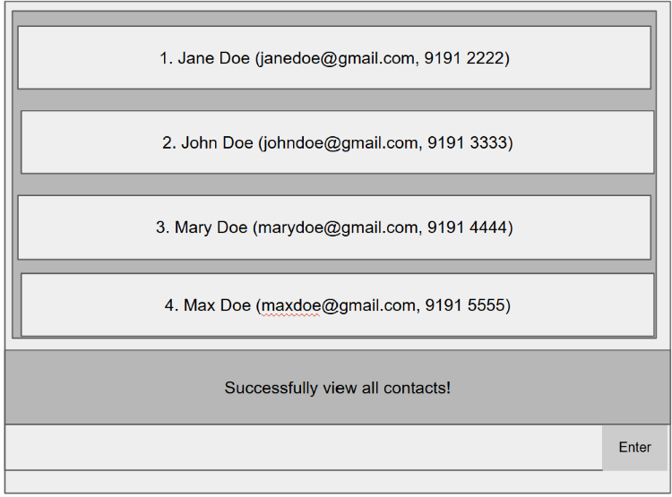

### Product name: TaskForge

### Project website: https://ay2526s2-cs2103t-w09-4.github.io/tp/

### Short description
TaskForge assists tech lead and project managers in organizing their team member contacts and their projects using intuitive CLI-like commands. The app enable effective management for team projects, task assignments and contact details.

### Target users
Tech project managers and team leads who manage multiple ongoing projects and team members, regularly update team information and task assignments, and prefer efficient keyboard-driven workflows over traditional GUI-heavy tools.

Tech lead and project managers who prefer efficient keyboard-driven workflows, comfortable with working with CLI commands and need to manage multiple projects and team members regularly.

### Key features
- Add and manage project team members with contact information 
- Create and organize multiple projects, assign team members to each project
- Add, track, and manage tasks assigned to team members across different projects
- View all projects and contacts information
- Search and filter contacts by name and project for quick team lookups

### Acknowledgement
TaskForge is built upon the AddressBook Level-3 template from [SE-EDU](https://github.com/se-edu/addressbook-level3) and adapted for project team management workflows.
