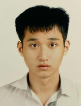
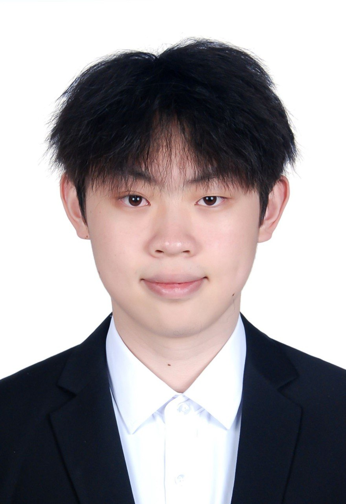

We are a team based in the [School of Computing, National University of Singapore](https://www.comp.nus.edu.sg).

You can reach us at the email `seer[at]comp.nus.edu.sg`

## Project team

### Dao Khac Hoang Vu

[[github](https://github.com/HoangVu123456)]

* Role: Developer
* Responsibilities: Team Lead, Scheduling and Tracking, Deliverables and Deadlines

### Hsu Myat Noe

[[github](https://github.com/ZealousGinger)]

* Role: Developer
* Responsibilities: Testing, Git expert

### Jane Doe

[[github](http://github.com/johndoe)]
[[portfolio](team/johndoe.md)]

* Role: Team Lead
* Responsibilities: UI

### Johnny Doe

[[github](http://github.com/johndoe)] [[portfolio](team/johndoe.md)]

* Role: Developer
* Responsibilities: Data

### Jean Doe

[[github](http://github.com/johndoe)]
[[portfolio](team/johndoe.md)]

* Role: Developer
* Responsibilities: Dev Ops + Threading

### Xu Jiaqi

[[github](http://github.com/jiaqixu1)]

* Role: Developer
* Responsibilities: Documentation, Code Quality
