* Table of Contents
{:toc}

--------------------------------------------------------------------------------------------------------------------

## **Acknowledgements**

* This project is based on the AddressBook-Level3 project created by the [SE-EDU initiative](https://se-education.org).
* Widespread code reuse of AI-generated work (GitHub Copilot) by Hsu, used for auto complete, generate alternative solutions, generate fixes/help with debugging, generate some code solutions.
* Code reuse of AB3 UserGuide and DeveloperGuide sections.
--------------------------------------------------------------------------------------------------------------------

## **Setting up, getting started**

Refer to the guide [_Setting up and getting started_](SettingUp.md).

--------------------------------------------------------------------------------------------------------------------

## **Design**

:bulb: **Tip:** The `.puml` files used to create diagrams are in this document `docs/diagrams` folder. Refer to the [_PlantUML Tutorial_ at se-edu/guides](https://se-education.org/guides/tutorials/plantUml.html) to learn how to create and edit diagrams.

### Architecture

The ***Architecture Diagram*** given above explains the high-level design of the App.

Given below is a quick overview of main components and how they interact with each other.

**Main components of the architecture**

**`Main`** (consisting of classes [`Main`](https://github.com/AY2526S2-CS2103T-W09-4/tp/blob/master/src/main/java/seedu/taskforge/Main.java) 
and [`MainApp`](https://github.com/AY2526S2-CS2103T-W09-4/tp/blob/master/src/main/java/seedu/taskforge/MainApp.java)) is in charge of the app launch and shut down.
* At app launch, it initializes the other components in the correct sequence, and connects them up with each other.
* At shut down, it shuts down the other components and invokes cleanup methods where necessary.

The bulk of the app's work is done by the following four components:

* [**`UI`**](#ui-component): The UI of the App.
* [**`Logic`**](#logic-component): The command executor.
* [**`Model`**](#model-component): Holds the data of the App in memory.
* [**`Storage`**](#storage-component): Reads data from, and writes data to, the hard disk.

[**`Commons`**](#common-classes) represents a collection of classes used by multiple other components.

**How the architecture components interact with each other**

The *Sequence Diagram* below shows how the components interact with each other for the scenario where the user issues the command `delete 1`.

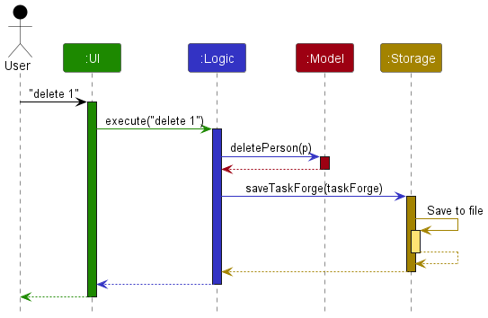

Each of the four main components (also shown in the diagram above),

* defines its *API* in an `interface` with the same name as the Component.
* implements its functionality using a concrete `{Component Name}Manager` class (which follows the corresponding API `interface` mentioned in the previous point.

For example, the `Logic` component defines its API in the `Logic.java` interface and implements its functionality using the `LogicManager.java` class which follows the `Logic` interface. Other components interact with a given component through its interface rather than the concrete class (reason: to prevent outside component's being coupled to the implementation of a component), as illustrated in the (partial) class diagram below.

The sections below give more details of each component.

### UI component

The **API** of this component is specified 
in [`Ui.java`](https://github.com/AY2526S2-CS2103T-W09-4/tp/blob/master/src/main/java/seedu/taskforge/ui/Ui.java)

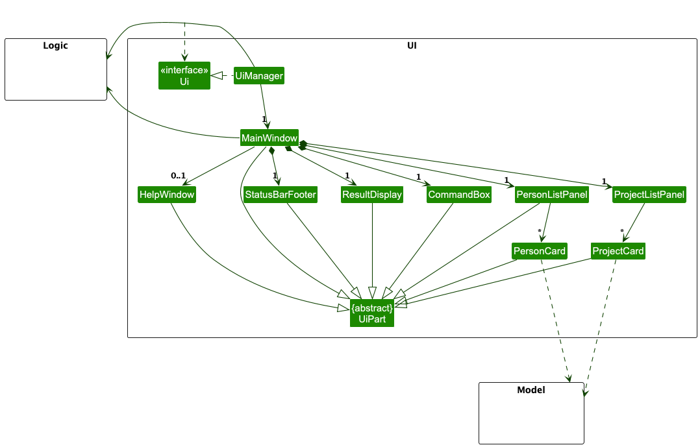

The UI consists of a `MainWindow` that is made up of parts such as
`CommandBox`, `ResultDisplay`, `PersonListPanel`, `ProjectListPanel`,
`StatusBarFooter`, etc. All these, including the `MainWindow`, inherit
from the abstract `UiPart` class which captures the commonalities between
classes that represent parts of the visible GUI.

The UI also includes additional windows such as `HelpWindow`, which displays
command usage instructions to the user.

The `UI` component uses the JavaFX UI framework. The layout of these UI parts
are defined in matching `.fxml` files located in the `src/main/resources/view` folder.
For example, the layout of the 
[`MainWindow`](https://github.com/AY2526S2-CS2103T-W09-4/tp/blob/master/src/main/java/seedu/taskforge/ui/MainWindow.java) 
is specified in [`MainWindow.fxml`](https://github.com/AY2526S2-CS2103T-W09-4/tp/blob/master/src/main/resources/view/MainWindow.fxml).

The `UiManager` implements the `Ui` interface and is responsible for
initializing and managing the JavaFX application.

The `UI` component:

* executes user commands by delegating to the `Logic` component.
* listens for changes to `Model` data and updates the UI accordingly.
* keeps a reference to the `Logic` component, as it relies on it to execute commands.
* depends on classes in the `Model` component, as it displays `Person` and `Project` objects, with their associated `Task` data embedded within the UI.
### Logic component

**API** : [`Logic.java`](https://github.com/AY2526S2-CS2103T-W09-4/tp/blob/master/src/main/java/seedu/taskforge/logic/Logic.java)

The following class diagram shows the structure of the `Logic` component:

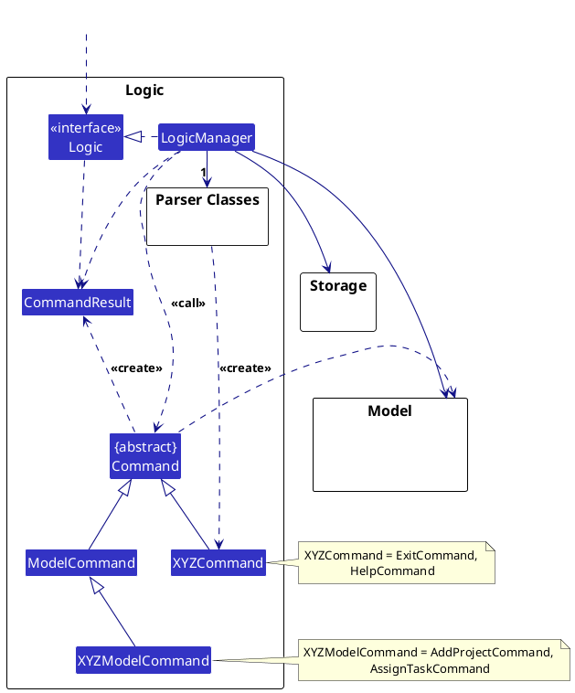

The sequence diagram below illustrates the interactions within the `Logic` component, taking the execution of `delete 1` as an example.

:information_source: **Note:** The lifeline for `DeleteCommandParser` should end at the destroy marker (X), but due to a limitation of PlantUML, the lifeline continues until the end of the diagram.

How the `Logic` component works:

1. When `Logic` is asked to execute a command, the command text is passed to a `TaskForgeParser` object.
1. The `TaskForgeParser` identifies the command word and delegates the parsing to the corresponding parser (for example, `DeleteCommandParser`).
1. The parser parses the user input and creates the appropriate `Command` object (for example, `DeleteCommand`).
1. The `LogicManager` then executes the `Command` object.
1. During execution, the command may interact with the `Model` to read or modify TaskForge data, such as persons, projects, or tasks.
1. The result of the command execution is encapsulated as a `CommandResult` object, which is returned by `Logic`.

The following classes in `Logic` are used to parse user commands:

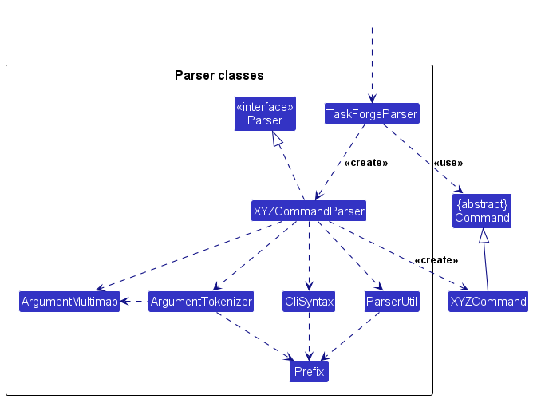

How the parsing works:

* When parsing a user command, the `TaskForgeParser` creates the corresponding command parser, such as `AddCommandParser`, `DeleteProjectCommandParser`, or `MarkTaskCommandParser`.
* That parser uses supporting classes such as `ArgumentTokenizer`, `ArgumentMultimap`, `CliSyntax`, and `ParserUtil` to process the input and construct the appropriate `Command` object.
* All command parser classes implement the `Parser` interface so that they can be handled consistently where appropriate, such as during testing.

### Model component

**API** : [`Model.java`](https://github.com/AY2526S2-CS2103T-W09-4/tp/blob/master/src/main/java/seedu/taskforge/model/Model.java)

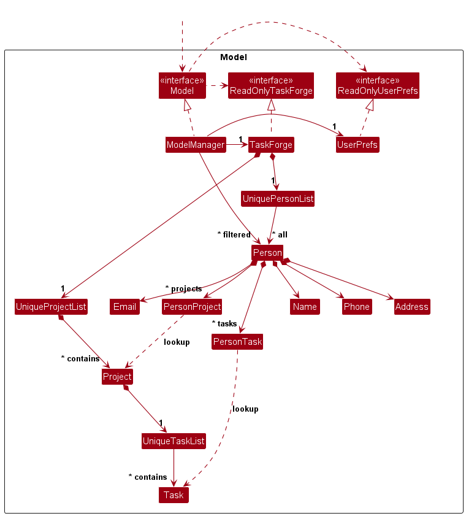

The `Model` component:

* stores TaskForge data, including `Person` and `Project` objects, as well as task-related data used by the application.
* stores a separate _filtered_ list of `Person` objects and a separate _filtered_ list of `Project` objects, which are exposed as unmodifiable `ObservableList`s so that the UI can automatically update when the data changes.
* stores a `UserPrefs` object that represents the user’s preferences. This is exposed to the outside as a `ReadOnlyUserPrefs` object.
* supports undo/redo by maintaining a versioned `TaskForge` state history.
* does not depend on the `Logic`, `UI`, or `Storage` components, as the `Model` represents the domain data and should be independent of the other components.

### Storage component

**API** : [`Storage.java`](https://github.com/AY2526S2-CS2103T-W09-4/tp/blob/master/src/main/java/seedu/taskforge/storage/Storage.java)

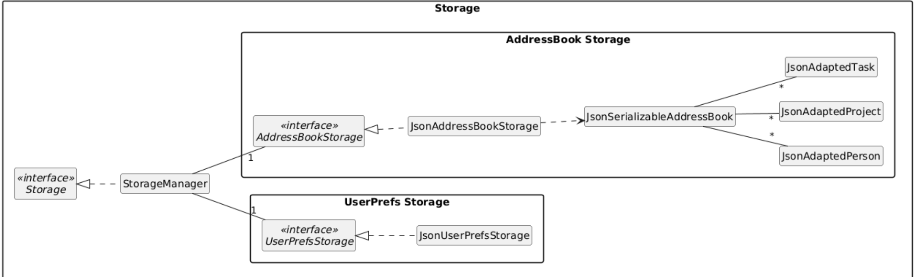

The `Storage` component:

* can save both TaskForge data and user preference data in JSON format, and read them back into corresponding objects.
* inherits from both `TaskForgeStorage` and `UserPrefsStorage`, which means it can be treated as either one when only specific functionality is required.
* uses JSON-adapted classes (e.g., `JsonAdaptedPerson`, `JsonAdaptedProject`, `JsonAdaptedTask`) to convert between in-memory model objects and JSON format.
* depends on classes in the `Model` component, as its responsibility is to persist and retrieve model data.

### Common classes

Classes used by multiple components are in the `seedu.taskforge.commons` package.

--------------------------------------------------------------------------------------------------------------------

## **Implementation**

This section describes some noteworthy details on how certain features are implemented.

### Undo/Redo feature

The undo/redo mechanism is facilitated by `VersionedTaskForge`. It extends `TaskForge` with an undo/redo history, stored internally as a list of TaskForge states and a pointer to the current state.

Additionally, it implements the following operations:

* `VersionedTaskForge#commit(String input)` — Saves the current TaskForge state in its history.
* `VersionedTaskForge#undo()` — Restores the previous TaskForge state from its history.
* `VersionedTaskForge#redo()` — Restores a previously undone TaskForge state from its history.

These operations are exposed in the `Model` interface as `Model#commitTaskForge(String input)`, `Model#undoTaskForge()` and `Model#redoTaskForge()` respectively.

---

### Example usage scenario

Step 1. The user launches the application for the first time. The `VersionedTaskForge` is initialized with the initial TaskForge state, and the current state pointer points to that initial state.

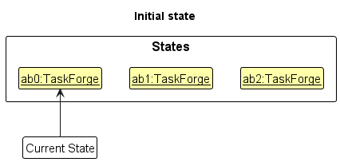

Step 2. The user executes a command that modifies data (e.g., `delete 5`).  
The command calls `Model#commitTaskForge(String input)`, causing the modified state to be saved, and the pointer moves to the new state.

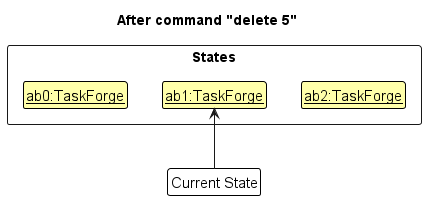

Step 3. The user executes another modifying command (e.g., adding a person, project, or task).  
The new state is again saved into the history.

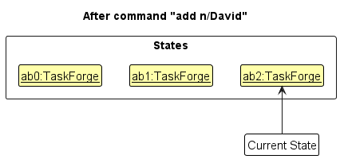

:information_source: **Note:** If a command fails, it will not call `Model#commitTaskForge(...)`, so no new state is saved.

Step 4. The user executes the `undo` command.  
The `undo` command calls `Model#undoTaskForge()`, shifting the pointer to the previous state and restoring it.

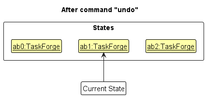

:information_source: **Note:** If there is no previous state, `Model#canUndoTaskForge()` will return false and the command will fail.

Step 5. The user executes a non-modifying command (e.g., `list`).  
Such commands do not call commit/undo/redo methods, so the state history remains unchanged.

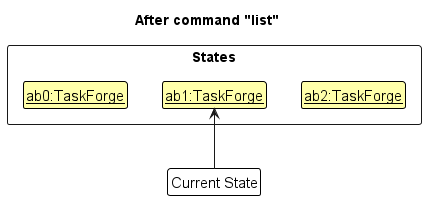

Step 6. The user executes another modifying command.  
If the pointer is not at the end of the history, all future states are discarded before saving the new state.

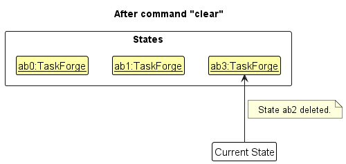

---

### Undo/Redo sequence diagrams

The following sequence diagram shows how an undo operation flows through the `Logic` component:

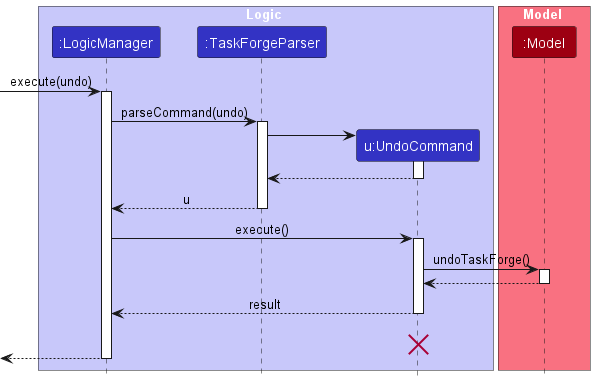

:information_source: **Note:** The lifeline for `UndoCommand` should end at the destroy marker (X), but due to a limitation of PlantUML, it extends to the end of the diagram.

Similarly, the interaction within the `Model` component is shown below:

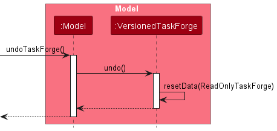

---

### Summary

The `redo` command performs the opposite operation of `undo`, restoring a previously undone state by calling `Model#redoTaskForge()`.

:information_source: **Note:** If there are no states to redo, `Model#canRedoTaskForge()` will return false and the command will fail.

---

### Activity Diagram

The following activity diagram summarizes what happens when a user executes a new command:

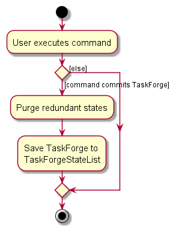
#### Design considerations:

**Aspect: How undo & redo executes:**

* **Alternative 1 (current choice):** Saves the entire taskforge.
  * Pros: Easy to implement.
  * Cons: May have performance issues in terms of memory usage.

* **Alternative 2:** Individual command knows how to undo/redo by
  itself.
  * Pros: Will use less memory (e.g. for `delete`, just save the person being deleted).
  * Cons: We must ensure that the implementation of each individual command are correct.

_{more aspects and alternatives to be added}_

### Project management feature (`project add`, `project delete`, `project list`, `project assign`, `project unassign`, `project find`, `project members`)

TaskForge supports project management through the parent command `project` with the following subcommands:
- `project add PROJECT_NAME`
- `project delete PROJECT_INDEX`
- `project list`
- `project assign PERSON_INDEX -i PROJECT_INDEX`
- `project unassign PERSON_INDEX -i PROJECT_INDEX`
- `project find [KEYWORD]`
- `project members PROJECT_INDEX`

#### Implementation overview

1. **Model layer**
   - `UniqueProjectList` stores globally unique project entries.
    - `Person` stores assigned projects as `List<PersonProject>`, where each `PersonProject` stores a project index refers to the index of Project inside the global UniqueProjectList.
    - Project references are resolved against the global UniqueProjectList when rendering UI output or validating commands.
   - `TaskForge` exposes project operations through methods such as
     `hasProject`, `addProject`, `setProject`, `removeProject`, `cascadeRemoveProjectFromPersons`, and `getProjectList`.

2. **Logic layer**
    - `AddProjectCommand` adds a new project to the global `UniqueProjectList`.
    - `DeleteProjectCommand` deletes a project from the global project list by index and removes it from all assigned persons.
    - `ListProjectCommand` displays all projects in the global project list.
    - `AssignProjectCommand` assigns project(s) from the global `UniqueProjectList` to a person.
    - `UnassignProjectCommand` removes assigned project(s) from a person.
    - `FindProjectCommand` searches the global project list and displays projects whose names match the given keyword(s).
    - `ViewProjectMembersCommand` displays all persons assigned to a specified project.
    - `TaskForgeParser` routes `project add`, `project delete`, `project list`, `project assign`, `project unassign`, `project find`, and `project members` to their corresponding command parsers and commands.

3. **Parser flow**
   - `TaskForgeParser#parseCommand` routes top-level `project` input to `TaskForgeParser#handleProject`.
   - `handleProject` extracts the project subcommand and dispatches as follows:
      - `add` -> `AddProjectCommandParser`
      - `delete` -> `DeleteProjectCommandParser`
      - `list` -> `ListProjectCommandParser`
      - `assign` -> `AssignProjectCommandParser`
      - `unassign` -> `UnassignProjectCommandParser`
      - `find` -> `FindProjectCommandParser`
      - `members` -> `ViewProjectMembersCommandParser`
   - Unknown or missing project subcommands throw a `ParseException` with `ProjectCommand.MESSAGE_USAGE`.

4. **Storage layer**
    - `JsonSerializableTaskForge` persists project data in the `projects` JSON array.
        - Person-side project assignments are stored as project references (`PersonProject`), rather than duplicating full `Project` objects.
        - During loading, these references are validated against the global project list before persons are reconstructed.
    - During deserialization, projects are restored into the model so that project data persists across application restarts.
        - `JsonSerializableTaskForge#toModelType()` validates cross-entity consistency to ensure reference integrity.

#### Validation and cascading behavior

**Project addition (`project add`)**:
- `AddProjectCommand` validates the project name against the defined project name constraints before adding it.
- Projects must be globally unique; attempting to add a duplicate project fails with `MESSAGE_DUPLICATE_PROJECT`.

**Project deletion (`project delete`)**:
- `DeleteProjectCommand` removes project(s) from the global `UniqueProjectList`.
- `TaskForge#cascadeRemoveProjectFromPersons()` automatically removes all assignments of the deleted project(s) from persons.
- Tasks associated with the removed project(s) are also removed from affected persons during the cascading update.

**Project listing (`project list`)**:
- `ListProjectCommand` retrieves and displays all projects in the global project list.
- No validation is required; the command succeeds regardless of the number of stored projects.
- It updates the filtered project list to show all projects.

**Project finding (`project find`)**:
- `FindProjectCommand` requires at least one keyword.
- `FindProjectCommandParser` throws a parse error if no keyword is provided.
- The command performs a case-insensitive search on project titles in the global project list.
- A project is included in the result if its title contains at least one of the given keywords.
- It updates the filtered project list to show the matching projects.

**Project assignment to person (`project assign`)**:
- `AssignProjectCommand` resolves each `PROJECT_INDEX` against the global project list.
- Invalid `PROJECT_INDEX` values are rejected.
- Each valid referenced project is converted into a `PersonProject` before being added to the person’s assigned project list, instead of storing the full `Project` object directly.
- Duplicate assignments are rejected with `MESSAGE_DUPLICATE_PROJECT`. 

**Project unassignment from person (`project unassign`)**:
- `UnassignProjectCommand` validates that the specified project(s) exist in the person’s assigned project list before unassignment.
- When a project is unassigned from a person, all tasks assigned to that person that belong to that project are also removed automatically.

**View project members (`project members`)**:
- `ViewProjectMembersCommand` validates that the provided `PROJECT_INDEX` is within bounds of the global project list.
- Invalid `PROJECT_INDEX` values are rejected.
- The command retrieves all persons whose assigned project list contains the specified project.
- Matching is done based on project references (e.g., `PersonProject`) rather than full `Project` objects.
- The command returns a formatted result displaying all members associated with the specified project.

#### Input parsing details

- `AddProjectCommandParser` parses the preamble as the new project `NAME`.
- `DeleteProjectCommandParser` parses the preamble as the target `PROJECT_INDEX`.
- `ListProjectCommandParser` takes no arguments; any extra input after `list` is ignored.
- `AssignProjectCommandParser` parses the preamble as the target `PERSON_INDEX` and parses one or more `PROJECT_INDEX` values using repeated `-i` prefixes.
- `UnassignProjectCommandParser` parses the preamble as the target `PERSON_INDEX` and parses one or more `PROJECT_INDEX` values using repeated `-i` prefixes.
- `FindProjectCommandParser` parses the input into one or more keywords.
- `ViewProjectMembersCommandParser` parses the preamble as the target `PROJECT_INDEX`.
- If no `PROJECT_INDEX` is provided (e.g., `project assign PERSON_INDEX` or `project unassign PERSON_INDEX`), parsing fails with `MESSAGE_NOT_EDITED`.
- If an incomplete `PROJECT_INDEX` is provided (e.g., `project assign PERSON_INDEX -i` or `project unassign PERSON_INDEX -i`), parsing fails with `MESSAGE_NOT_EDITED`.

#### Execution behavior and validation in person-related commands

When a user adds or edits a person including changing project assignments, each project value must be checked to see whether it already exists in the global project list:

- `AddCommand` validates each project via `model.hasProject(project)` before adding the person.
- `EditCommand` validates each edited project via `model.hasProject(project)` before committing changes.
- If any project is missing, command execution fails with `MESSAGE_PROJECT_NOT_FOUND`.

This ensures a person can only be assigned to valid existing projects.

### Task management feature (`task add`, `task delete`, `task edit`, `task list`, `task find`, `task assign`, `task unassign`, `task view`, `task mark`, `task unmark`)

TaskForge supports task management using 10 commands:
- `task add PROJECT_INDEX -n TASK_NAME`
- `task delete PROJECT_INDEX -i TASK_INDEX_FROM_PROJECT`
- `task edit PERSON_INDEX -i TASK_INDEX_FROM_PERSON -n NEW_TASK_NAME`
- `task list PROJECT_INDEX`
- `task find KEYWORD [MORE_KEYWORDS]`
- `task assign PERSON_INDEX -pi PROJECT_INDEX -i TASK_INDEX_FROM_PROJECT`
- `task unassign INDEX -i TASK_INDEX_FROM_PERSON`
- `task view PERSON_INDEX`
- `task mark PERSON_INDEX TASK_INDEX_FROM_PERSON`
- `task unmark PERSON_INDEX TASK_INDEX_FROM_PERSON`

#### Implementation overview

1. **Model layer**
   - `UniqueTaskList` stores task entries within each project.
   - `Project` exposes task operations through methods such as `hasTask`, `addTask`, `removeTask`, and `getTasks`.
    - `Person` stores assigned tasks as `List<PersonTask>`, where each `PersonTask` stores `(projectIndex, taskIndex)` refers to the index of Project in the global UniqueProjectList and the index of task inside the UniqueTaskList of the Project.
   - `TaskForge` provides cascade deletion from all task assignments when a task is deleted from a project.
   - `Task` includes an `isDone` boolean field to track the completion status of a task. It provides `getStatus()`, `setDone()`, and `setNotDone()` methods.

2. **Logic layer**
    - `AddTaskCommand` adds new task(s) to a project in the global project list.
    - `DeleteTaskCommand` removes task(s) from a project by project index and task index.
    - `EditTaskCommand` renames a task in a person by person index and task index.
    - `ListTaskCommand` lists all task(s) from a specified project by project index.
    - `FindTaskCommand` finds task(s) across all projects by keyword(s).
    - `AssignTaskCommand` assigns existing task(s) to a person.
    - `UnassignTaskCommand` unassigns task(s) from a person.
    - `ViewTasksCommand` displays all tasks assigned to a person.
    - `MarkTaskCommand` marks a task as done for a specific person.
    - `UnmarkTaskCommand` marks a task as not done for a specific person.
    - `TaskForgeParser` routes task subcommands to their corresponding command parsers/commands.
    - `TaskForgeParser` routes `task add`, `task delete`, `task list`, `task find`, `task assign`, `task unassign`, and `task view` to their corresponding command parsers/commands.

3. **Parser flow**
   - `TaskForge#parseCommand` routes top-level `task` input to `TaskForgeParser#handleTask`.
   - `handleTask` extracts the task subcommand and dispatches as follows:
      - `add` -> `AddTaskCommandParser`
      - `delete` -> `DeleteTaskCommandParser`
      - `edit` -> `EditTaskCommandParser`
      - `list` -> `ListTaskCommandParser`
      - `find` -> `FindTaskCommandParser`
      - `assign` -> `AssignTaskCommandParser`
      - `unassign` -> `UnassignTaskCommandParser`
      - `view` -> `ViewTasksCommandParser`
      - `mark` -> `MarkTaskCommandParser`
      - `unmark` -> `UnmarkTaskCommandParser`
   - Unknown or missing task subcommands throw a `ParseException` with `TaskCommand.MESSAGE_USAGE`.

4. **Storage layer**
      - `JsonAdaptedTask` handles serialization/deserialization of task objects.
      - Person-side task assignments are persisted as `PersonTask` references `(projectIndex, taskIndex)`.
    - During deserialization, tasks are restored into projects so task entries persist across application restarts.
      - During deserialization, invalid task references (missing project index or task index) are rejected.

#### Validation and cascading behavior

**Task addition (`task add`)**:
- `AddTaskCommand` validates the project index and task name constraints before adding.
- Tasks are stored at the project level, maintaining project-specific task uniqueness.
- Rejects duplicate tasks via `MESSAGE_DUPLICATE_TASK`.

**Task deletion from project (`task delete`)**:
- `DeleteTaskCommand` removes task(s) from a project by project index and task index.
- `TaskForge#cascadeRemoveDeletedProjectTasksFromPersons()` automatically removes the deleted task from all persons who have it assigned.

**Task editing in project (`task edit`)**:
- `EditTaskCommand` validates that the person index and task index is within bounds.
- The command renames the selected project task and rejects duplicates via `MESSAGE_DUPLICATE_TASK`.
- Before applying the rename, the command snapshots people currently assigned to the original task.
- After updating the project, it reassigns each affected person to the renamed task so assignments are preserved.

**Task listing by project (`task list`)**:
- `ListTaskCommand` validates that the provided project index is valid in the global project list.
- Retrieves and displays all tasks in the specified project.

**Task finding by keyword (`task find`)**:
- `FindTaskCommand` iterates through task lists of all projects.
- Matches tasks whose names contain any provided keywords.
- Returns output in the format `taskName - projectName`.
- Updates the filtered project list to show projects that contain matching tasks.

**Task assignment to person (`task assign`)**:
- `AssignTaskCommand` resolves each selected `TASK_INDEX` into a `(projectIndex, taskIndex)` pair based on tasks
  available from the person's assigned projects.
- Invalid `TASK_INDEX` values are rejected.
- Rejects duplicate assignments via `MESSAGE_DUPLICATE_TASK`.

**Task viewing (`task view`)**:
- `ViewTasksCommand` retrieves the selected person's task list and displays all tasks assigned to that person.
- No validation is required; the command only retrieves and displays information.

**Task unassignment from person (`task unassign`)**:
- `UnassignTaskCommand` removes task(s) from a person by task index.
- Validates whether or not the task exist in the person's assigned projects before unassignment.
- Resolves each local task index from the selected person's task list and unassigns them, throwing `MESSAGE_INDEX_OUT_OF_BOUND` if any task index is invalid.

**Task marking (`task mark`)**:
- `MarkTaskCommand` marks a task as done for a person by task index.
- Validates person index and task index.
- Throws `MESSAGE_TASK_ALREADY_DONE` if the task is already marked as done.
- Creates a new `Person` with the updated task list and replaces the old person in the model.

**Task unmarking (`task unmark`)**:
- `UnmarkTaskCommand` marks a task as not done for a person by task index.
- Validates person index and task index.
- Throws `MESSAGE_TASK_ALREADY_NOT_DONE` if the task is already marked as not done.
- Creates a new `Person` with the updated task list and replaces the old person in the model.

#### Input parsing details

- `AddTaskCommandParser` parses the preamble as the target `PROJECT_INDEX` and parses one or more task names using repeated `-n` prefixes.
- `DeleteTaskCommandParser` parses the preamble as the target `PROJECT_INDEX` and parses one or more `TASK_INDEX_FROM_PROJECT` values using repeated `-i` prefixes.
- `EditTaskCommandParser` parses the preamble as the target `PERSON_INDEX`, parses `TASK_INDEX_FROM_PERSON` from `-i`, and parses the new task name from `-n`.
- `ListTaskCommandParser` parses the preamble as the target `PROJECT_INDEX`.
- `FindTaskCommandParser` parses the input into one or more keywords.
- `AssignTaskCommandParser` parses the preamble as the target `PERSON_INDEX`, parses `PROJECT_INDEX` from `-pi`, and parses one or more `TASK_INDEX_FROM_PROJECT` values using repeated `-i` prefixes.
- `UnassignTaskCommandParser` parses the preamble as the target `PERSON_INDEX` and parses one or more `TASK_INDEX_FROM_PERSON` values using repeated `-i` prefixes.
- `ViewTasksCommandParser` parses the preamble as the target `PERSON_INDEX`.
- `MarkTaskCommandParser` and `UnmarkTaskCommandParser` parse the preamble as the target `PERSON_INDEX` followed by `TASK_INDEX_FROM_PERSON`.
- If no task indexes are provided where required (e.g., `task delete PROJECT_INDEX`, `task assign PERSON_INDEX -pi PROJECT_INDEX`, or `task unassign PERSON_INDEX`), parsing fails with the corresponding `MESSAGE_NOT_EDITED`.
- If an incomplete task argument is provided (e.g., `task delete PROJECT_INDEX -i`, `task assign PERSON_INDEX -pi PROJECT_INDEX -i`, or `task unassign PERSON_INDEX -i`), parsing fails with the corresponding `MESSAGE_NOT_EDITED`.

#### Execution behavior and validation

- Person-targeting command`, `task unassign`, `task view`) resolve the target person from `model.getFilteredPersonList()` using the supplied person `PERSON_INDEX`.
- If the person index is invalid, execution fails with `Messages.MESSAGE_INVALID_PERSON_DISPLAYED_INDEX` or the command-specific invalid index message.
- `AddTaskCommand` and `DeleteTaskCommand` resolve the target project from the list and validate the project index before executing.
- `EditTaskCommand` resolves the target person by index and validates both the person index and task index before executing.
- `ListTaskCommand` resolves the target project by project name and fails if the project does not exist.
- `FindTaskCommand` resolves across all project task lists and returns matching task entries in `taskName - projectName` format.
- On success, `AddTaskCommand`, `DeleteTaskCommand`, `EditTaskCommand`, `AssignTaskCommand`, and `UnassignTaskCommand` update the model.
- `ListTaskCommand`, `FindTaskCommand`, and `ViewTasksCommand` only retrieve and display information without modifying model data.

#### Availability feature

The `Person` model includes `getWorkload()` and `getAvailability()` methods to compute a person's availability based on their assigned tasks.

`getWorkload()` returns the number of incomplete tasks, while `getAvailability()` returns an `Availability` enum (FREE, AVAILABLE, BUSY, OVERLOADED) based on predefined thresholds.
The availability status is displayed in the `PersonCard` UI as a colored circle next to the number of workload.

#### Model-storage consistency contract

- Model side: assigned projects/tasks are stored on `Person` as references (`PersonProject`, `PersonTask`) to Project and Task.
- Storage side: JSON loading enforces that project and task references remain valid against the global project or project's task lists before data is accepted.
- This ensure consistent when editting data from the database.

### \[Proposed\] Data archiving

_{Explain here how the data archiving feature will be implemented}_

--------------------------------------------------------------------------------------------------------------------

## **Documentation, logging, testing, configuration, dev-ops**

* [Documentation guide](Documentation.md)
* [Testing guide](Testing.md)
* [Logging guide](Logging.md)
* [Configuration guide](Configuration.md)
* [DevOps guide](DevOps.md)

--------------------------------------------------------------------------------------------------------------------

## **Appendix: Requirements**

### Product scope

**Target user profile**:

* Has a need to manage a significant number of team members and their task assignments (mainly project managers)
* Prefer desktop apps over other types
* Can type fast
* Prefers keyboard-driven workflows over traditional GUI-heavy tools
* Example: Tech lead and project managers who prefer efficient keyboard-driven workflows, comfortable working with CLI commands and need to manage multiple projects and team members regularly.

**Value proposition**: manage tasks and projects more efficiently with keyboard-based interaction rather than GUI. This project management system supports dynamic task tracking and human resource management.

### User stories

Priorities: High (must have) - `* * *`, Medium (nice to have) - `* *`, Low (unlikely to have) - `*`

| Priority | As a …​ | I want to …​                           | So that I can…​                                                              |
|---------|------|----------------------------------------|------------------------------------------------------------------------------|
| `* * *` | user | add a contact                          | keep track of project members.                                               |
| `* * *` | user | delete a contact                       | remove outdated information or remove a member from the project.             |
| `* * *` | user | add a project                          | keep track of projects.                                                      |
| `* * *` | user | remove a project                       | remove completed or discarded project.                                       |
| `* * *` | user | assign a project to a contact          | assign member to the project                                                 |
| `* * *` | user | unassign a project from a contact      | remove members from a project                                                |
| `* * *` | user | add tasks to contact                   | clearly know about their responsibilities                                    |
| `* * *` | user | delete tasks from a contact            | easily remove tasks that is falsely assigned to the contact or has been done |
| `* * *` | user | view all contacts                      | see all the project members contacts                                         |
| `* * *` | user | view all projects                      | easily have an overview of all projects                                      |
| `* * *` | user | view all tasks assigned to the contact | see all the tasks assigned to a contact                                      |
| `* * *` | user | find projects by name                  | quickly locate relevant projects from the global project list                |
| `* * *` | user | find contacts by any parameters        | quickly find someone                                                         |
| `*`     | user | view team member's availability        | who is free to take on work                                                  |
| `* * `  | user | undo the last action                   | recover from mistakes                                                       |
| `* * `  | user | redo the last action                   | restore changes if I undo by mistake                                     |

*{More to be added}*

### Use cases

(For all use cases below, the **System** is the `TaskForge` and the **Actor** is the `user`, unless specified otherwise)

**Use case: UC01 Add a contact**

**Guarantees**

1. The new contact specified will be added to TaskForge if the command parameters are valid.
2. The new contact will not be added to TaskForge if there is a missing or invalid parameter needed for the contact.

**MSS**

1.  User enters the command in the input to add a new contact.
2.  TaskForge displays a success message in the reply dialog.
3.  TaskForge displays the new contact in the contact list.

    Use case ends.

**Extensions**

* 1a. TaskForge detects incorrect command input.

    * 1a1. TaskForge displays an error message on the invalid parameter.
    * 1a2. User enters the command again.
    * Steps 1a1-1a2 are repeated until the command entered is valid.

      Use case resumes at step 2.
  Use case ends.

**Use case: UC02 Add a project to a contact**

**Guarantees**

1. The new project will be successfully added to the specified contact when the command is valid.
2. The new project will not be added to non-existing or invalid contact.

**MSS**

1. User requests to view all contacts.
2. TaskForge displays the list of contacts.
3. User requests to add a project to a contact.
4. TaskForge checks the existence of the contact.
5. TaskForge adds a project to a contact and displays success message.

   Use case ends.

**Extensions**

* 1a. TaskForge detects invalid command input.
	 * 1a1. TaskForge displays an error message.
	 * 1a2. User enters the command again.
    * Steps 1a1-1a2 are repeated until the input entered are valid.

   Use case resumes from step 2.

* 2a. TaskForge could not find the mentioned contact.
	 * 2a1. TaskForge displays an error message.
	 * 2a2. User enters the command again.
	 * Steps 2a1-2a2 are repeated until the input entered are valid.

   Use case resumes from step 2.

**Use case: UC03 Delete a task from a contact**

**Guarantees**

1. The task is deleted from the contact if successful.
2. The task is not deleted if there is missing information or invalid input.

**MSS**

1. User requests for a list of all tasks assigned to the contact.
2. TaskForge displays the tasks assigned to the selected contact.
3. User requests to delete the selected task.
4. TaskForge deletes the task and shows a confirmation message.

   Use case ends.

**Extensions**

* 1a. Contact does not exist.
	 * 1a1. TaskForge shows an error message.
	 * 1a2. User enters new input.
    * Steps 1a1-1a2 are repeated until the input entered are valid.

   Use case ends.

* 2a. Task does not exist.
	 * 2a1. TaskForge shows an error message.
	 * 2a2. User enters new input.
	 * Steps 2a1-2a2 are repeated until the input entered are valid.

     * Use case ends.

**Use case: UC04 View all contacts**

**MSS**

1. User request to view all contacts.
2. TaskForge return the list with all contacts.

   Use case ends.

**Extensions**

* 1a. TaskForge detects error in CLI command.
	 * 1a1. TaskForge returns the error message.
	 * 1a2. User input another command.
    * Steps 1a1 - 1a2 are repeated until the command is correct.

   Use case ends.

**Use case: UC05 Find projects by name**

**Guarantees**

1. Matching projects are displayed if at least one project title contains the given keyword.
2. No project is modified during this operation.

**MSS**

1. User enters a command to find a project by keyword.
2. TaskForge searches the global project list.
3. TaskForge displays the matching project titles as text.

**Extensions**
* 1a. User enters an invalid command format.
    * 1a1. TaskForge shows an error message.
    * 1a2. User enters the command again.
    * Steps 1a1-1a2 are repeated until the input is valid.

  Use case ends.

* 2a. No project matches the keyword.
    * 2a1. TaskForge displays a message that no matching projects were found.

  Use case ends.

**Use case: UC06 View all tasks assigned to a contact**

**Guarantees**

1. The tasks assigned to the selected contact are displayed if the input is valid.
2. No data is modified during this operation.

**MSS**

1. User requests to view all contacts.
2. TaskForge displays the list of contacts.
3. User requests to view all tasks assigned to a contact.
4. TaskForge displays all tasks assigned to the selected contact.

   Use case ends.

**Extensions**

* 1a. The specified contact index is invalid.
    * 3a1. TaskForge displays an error message.
    * 3a2. User enters a valid command again.

      Use case resumes at step 4.

* 1b. The selected contact has no assigned tasks.
    * 3b1. TaskForge displays a message indicating that the contact has no tasks.

      Use case ends.

**Use case: UC07 - Undo previous command**

**Actor**: User

**Guarantees**

1. The previous change made to the taskforge is reverted.

**MSS**

1. User requests to undo previous command.
2. TaskForge checks if there is a previous state available.
3. TaskForge shifts the current state into the previous state.
4. TaskForge confirms to the user that the last action has been undone and displays the previous state.

    Use case ends.

**Extensions**

* 2a. No previous state available.
    * 2a1. TaskForge displays error message.

    Use case ends.

*{More to be added}*

### Non-Functional Requirements

#### Usability
- A user with above average typing speed for regular English text (i.e. not code, not system admin commands) should be able to accomplish most of the tasks faster using commands than using the mouse.
- A user should be able to use the app without mouse / button interactions.
- The GUI should display correctly without resolution-related issues on screen resolutions 1920×1080 and higher with 100% and 125% screen scaling. The system should remain usable (all functions accessible even if the layout is not optimal) on resolutions 1280×720 and higher with 150% screen scaling.
- The product should be for a single user.

#### Technical
- The product should work on any mainstream OS as long as it has Java 17.
- The product should not depend on external remote servers.

#### Constraints
- The product needs to be developed in a breadth-first incremental manner over the project duration.

#### Data
- All data is stored locally in a human editable file.
- The product should not use a Database management system  to store data.

#### Process
- Every PR need to pass the CI and page deployment checks before merging.
- The product should be packaged into 1 JAR file only.

#### Portability
- The app should run without requiring any installation (excepting for Java 17 installation).

#### Performance
- The system should respond to user commands within 5 seconds under normal usage conditions.
- Starting the application requires less than 5 seconds.

#### Capacity
- The system should be able to handle at least 100 contacts and 1000 tasks without noticeable performance degradation.
- The product JAR/ZIP file should be at maximum 100MB and each document should be at maximum 15MB.

#### Security
- The system should store user data locally and should not transmit information over a network.

#### Robustness
- The system should handle invalid user inputs gracefully, displaying appropriate error messages instead of crashing.

#### Testability
- The system should support automated unit tests and integration tests to verify system functionality.

#### Reliability
- The system should not lose stored data during normal operation.
- The system should not corrupt data on unexpected shutdown.

#### Maintainability
- The code should follow good Object-Oriented Programming principles.
- The code should maintain a good approach in coding standard.
- The developer guide and user guide should be PDF-friendly.

### Glossary

* **Contact**: A person who is involved in a project and can be assigned tasks
* **Task**: A unit of project that needs to be completed by a contact
* **Project**: A collection of tasks and contacts organized to achieve a specific goal
* **GUI**: Graphical user interface of the application
* **Mainstream OS**: Mainstream OS stands for Mainstream Operating System which include MacOS, Linux and Windows
* **PR**: Pull request in Github
* **CLI**: A command line interface (CLI) is a text-based interface where you can input commands that interact with a computer's operating system.
* **User**: Project managers and team leaders who preferred CLI
* **JAR**: Java ARchive, a file format to run java program
* **ZIP**: a file format to compress one or more files into 1 single file
* **CI**: Continuous Integration which is a software development practice in which code changes are frequently integrated into a shared repository and automatically built and tested to detect issues early
* **Page deployment**: The product website page that is being deployed on Github
* **Unit test**: A testing method to test units of code
* **Integration test**: A software testing phase where individual units or modules are combined and tested as a group to verify they function correctly together
* **Command**: A text instruction entered by the user in the CLI to perform a specific operation in the system
* **Command parameters**: Parameters that are part of a command to specify information
* **Remote servers**: A computer located elsewhere that stores data, hosts applications, or processes tasks, accessible over a network or the Internet
* **Breadth-first Incremental manner**: A development strategy where small portions of functionality are added across the whole system step by step, instead of completing one feature fully before starting another

--------------------------------------------------------------------------------------------------------------------

## **Appendix: Instructions for manual testing**

Given below are instructions to test the app manually.

:information_source: **Note:** These instructions only provide a starting point for testers to work on;
testers are expected to do more *exploratory* testing.

### Launch and shutdown

1. Initial launch

   i. Download the jar file and copy into an empty folder

   ii. Double-click the jar file Expected: Shows the GUI with a set of sample contacts. The window size may not be optimum.

2. Saving window preferences

   i. Resize the window to an optimum size. Move the window to a different location. Close the window.

   ii. Re-launch the app by double-clicking the jar file. 
       Expected: The most recent window size and location is retained.

1. _{ more test cases …​ }_

### Deleting a person

1. Deleting a person while all persons are being shown

   i. Prerequistes: Execute the following commands before testing:
   - `clear`
   - `add -n Alice -p 11111111 -e alice@example.com`
   - `add -n Bob -p 22222222 -e bob@example.com`
   - `list`

   ii. Test case: `delete 1` 
      Expected: First contact is deleted from the list. Details of the deleted contact shown in the status message. Timestamp in the status bar is updated.

   iii. Test case: `delete 0` 
      Expected: No person is deleted. Error details shown in the status message. Status bar remains the same.

   iv. Other incorrect delete commands to try: `delete`, `delete x`, `...` (where x is larger than the list size) 
      Expected: Similar to previous.

### Finding a person (`find`)

1. Finding persons by prefixed keywords

   1. Prerequisites: Prepare a minimal dataset using the following inputs:
      `clear`
      `add -n Alice Tan -p 91234567 -e alice@example.com`
      `add -n Bob Lee -p 92345678 -e bob@example.com`
   2. Test case: `find -n alice` 
      Expected: One person is listed (`Alice Tan`).
   3. Test case: `find -n carol` 
      Expected: No person is listed (`0 persons listed!`).

### Finding a project

1. Finding projects by name

   i. Prerequistes: Execute the following commands before testing:
   - `clear`
   - `project add Alpha`
   - `project add Alpha Backend`
   - `project add Beta`
   - `project list`

    ii. Test case: `project find alpha`
       Expected: All projects whose titles contain `alpha` are shown in the result display.

    iii. Test case: `project find beta`
       Expected: The matching project is shown in the result display.

    iv. Test case: `project find gamma`
       Expected: A message is shown indicating that no matching projects were found.

    v. Test case: `project find`
       Expected: Invalid command format message is shown.

1. _{ more test cases …​ }_

### Assigning a project (`project assign`)

1. Assigning one or more projects to a person

   i. Prerequisites: Prepare a minimal dataset using the following inputs:
      `clear`
      `add -n Alice -p 91234567 -e alice@example.com`
      `project add Alpha`
      `project add Beta`
   ii. Test case: `project assign 1 -i 1` 
      Expected: Success message is shown. `list` displays Alice with project `Alpha` assigned.
   iii. Test case: `project assign 1 -i 2` 
      Expected: Success message is shown. Alice now has both `Alpha` and `Beta` assigned.
   iv. Test case: `project assign 1 -i 1` (run again) 
      Expected: No data is changed. A duplicate project error is shown.

### Unassigning a project (`project unassign`)

1. Unassigning project(s) from a person

   i. Prerequisites: Prepare a minimal dataset using the following inputs:
      `clear`
      `add -n Alice -p 91234567 -e alice@example.com`
      `project add Alpha`
      `project add Beta`
      `project assign 1 -i 1 -i 2`
      `task add 1 -n Draft API`
      `task add 2 -n Prepare Demo`
      `task assign 1 -pi 1 -i 1 -pi 2 -i 1`
   ii. Test case: `project unassign 1 -i 2` 
      Expected: Success message is shown. Alice no longer has the second assigned project, and `task view 1` no longer shows tasks that belong to that removed project.
   iii. Test case: `project unassign 1 -i 3` 
      Expected: No data is changed. An invalid project index error is shown.

### Editing a task (`task edit`)

1. Renaming a task from a person's assigned task list

   i. Prerequisites: Prepare a minimal dataset using the following inputs:
       `clear`
       `add -n Alice -p 91234567 -e alice@example.com`
       `project add Alpha`
       `project assign 1 -i 1`
       `task add 1 -n Draft API`
       `task assign 1 -pi 1 -i 1`
   ii. Test case: `task edit 1 -i 1 -n Finalise API` 
   Expected: Success message is shown. `task view 1` and `task list 1` both show `Finalise API`, and `Draft API` is no longer shown.
   iii. Test case: `task edit 2 -i 1 -n Anything` 
   Expected: No data is changed. An invalid person index error is shown.
   iv. Test case: `task edit 1 -i 2 -n Anything` 
   Expected: No data is changed. A task index out-of-bound error is shown.
   v. Test case: `task add 1 -n Prepare Demo`, then `task edit 1 -i 1 -n Prepare Demo` 
   Expected: No data is changed. A duplicate task error is shown.

### Marking and unmarking a task (`task mark`, `task unmark`)

1. Marking and unmarking a person's assigned task

   i. Prerequisites: Reuse the dataset from the `task edit` section above.
   ii. Test case: `task mark 1 1` 
      Expected: Success message is shown.
   iii. Test case: `task mark 1 1` (run again) 
      Expected: No data is changed. An error indicates that the task is already marked as done.
   iv. Test case: `task unmark 1 1` 
      Expected: Success message is shown.
### Adding a project

1. Adding a project and verifying project uniqueness

   i. Prerequistes: Execute the following commands before testing:
   - `clear`
   - `list`
   - `project list`

   ii. Test case: `project add Alpha` 
      Expected: Project `Alpha` is added successfully and appears in project list.

   iii. Test case: `project add Alpha` (run again) 
      Expected: Command fails with duplicate-project error. No new project is added.

   iv. Test case: `project add 你好` 
      Expected: Invalid format/constraint error shown. No project is added.

### Deleting a project

1. Deleting a project and cascade cleanup all project instances

   i. Prerequistes: Execute the following commands before testing:
   - `clear`
   - `add -n Alice -p 11111111 -e alice@example.com`
   - `project add Alpha`
   - `project add Beta`
   - `task add 1 -n SeedTask`
   - `project assign 1 -i 1`
   - `task assign 1 -pi 1 -i 1`
   - `project list`
   - `task view 1`

   ii. Test case: `project delete 1` 
      Expected: Project at index `1` is deleted. That project is deleted from every Persons/Contacts that have been assigned along with their tasks.

   iii. Test case: `project delete 0` 
      Expected: Invalid project index error. No data changed.

### Adding a task

1. Adding a task to a project and verifying task uniqueness in the project's task list

   i. Prerequistes: Execute the following commands before testing:
   - `clear`
   - `project add Alpha`
   - `project list`
   - `task list 1`

   ii. Test case: `task add 1 -n Review API` 
      Expected: Task is added under project `1`.
   
   iii. Test case: `task add 1 -n Review API` (run again) 
      Expected: Duplicate-task error for that project. No second copy is added.

   iv. Test case: `task add 999 -n Review API` 
      Expected: Project index out of bound error.

### Deleting a task
1. Deleting task(s) from a project and cascade cleanup all task instances

   i. Prerequistes: Execute the following commands before testing:
   - `clear`
   - `add -n Alice -p 11111111 -e alice@example.com`
   - `project add Alpha`
   - `project assign 1 -i 1`
   - `task add 1 -n TempA`
   - `task add 1 -n TempB`
   - `task assign 1 -pi 1 -i 1`
   - `task view 1`

   ii. Test case: `task delete 1 -i 1` 
      Expected: Task at index `1` in project `1` is deleted. Any contact/person assignment of that task is deleted. The other remaining task assignments of that contacts/persons will get their index renumbered.

   iii. Test case: `task delete 1 -i 999` 
      Expected: Task index out of bound error. No task removed.

### Assigning a task
1. Assigning task(s) to a person

   i. Prerequistes: Execute the following commands before testing:
   - `clear`
   - `add -n Alice -p 11111111 -e alice@example.com`
   - `project add Alpha`
   - `project add Beta`
   - `project assign 1 -i 1`
   - `task add 1 -n AssignMe`
   - `task add 2 -n BetaTask`
   - `task view 1`

   ii. Test case: `task assign 1 -pi 1 -i 1` 
      Expected: Task is assigned to person `1` successfully.

   iii. Test case: `task assign 1 -pi 1 -i 1` (run again) 
      Expected: Duplicate-task-assignment error.

   iv. Test case: `task assign 1 -pi 0 -i 1` 
      Expected: Invalid project index error.

   v. Test case: `task assign 1 -pi 1 -i 0` 
      Expected: Invalid task index error.

   vi. Test case: `task assign 1 -pi 2 -i 1` where person `1` is not assigned to project `2` 
      Expected: Task does not exist in any contact/person's project assigned error.

### Unassigning a task
1. Unassigning task(s) from a person

   i. Prerequistes: Execute the following commands before testing:
   - `clear`
   - `add -n Alice -p 11111111 -e alice@example.com`
   - `project add Alpha`
   - `project assign 1 -i 1`
   - `task add 1 -n RemoveMe`
   - `task assign 1 -pi 1 -i 1`
   - `task view 1`

   ii. Test case: `task unassign 1 -i 1` 
      Expected: First task in that person's assigned-task view is removed.

   iii. Test case: `task unassign 1 -i 999` 
      Expected: Task index out of bound error. No task removed.

1. Verifying `UniqueProjectList` and `UniqueTaskList` behavior through commands

   i. Prerequistes: Execute the following commands before testing:
   - `clear`
   - `project add Alpha`
   - `project add Beta`

   i. `UniqueProjectList` check:
      Add project title `Alpha` 2 times in a row using `project add Alpha` command
      Expected: Second command fails as duplicate.

   ii. `UniqueTaskList` check:
      Add task title `Beta` 2 times in a row using `task add 1 -n Beta` command
      Expected: Second command fails as duplicate.

   iii. Control check:
      Add same task name to a different project.
      Execeute `task add 1 -n Beta` and then `task add 2 -n Beta`.
      Expected: Allowed, because uniqueness is enforced per project task list.

### Saving data

1. Dealing with missing/corrupted data files

   1. _{explain how to simulate a missing/corrupted file, and the expected behavior}_

1. _{ more test cases …​ }_
