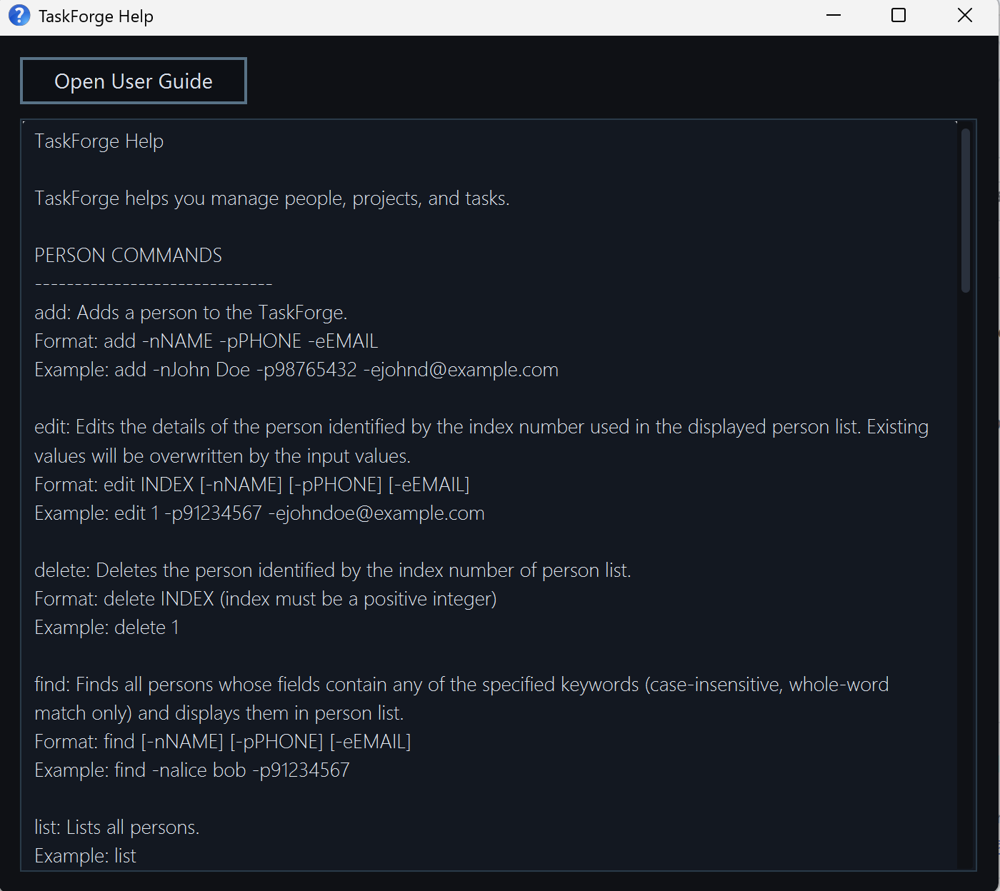

TaskForge is a **desktop app for managing contacts, optimized for use via a Command Line Interface** (CLI) while still having the benefits of a Graphical User Interface (GUI). If you can type fast, TaskForge can get your contact management tasks done faster than traditional GUI apps.

* Table of Contents
{:toc}

--------------------------------------------------------------------------------------------------------------------

## Quick start

1. Ensure you have Java `17` or above installed in your Computer. 
   **Mac users:** Ensure you have the precise JDK version prescribed [here](https://se-education.org/guides/tutorials/javaInstallationMac.html).

1. Download the latest `.jar` file from [here](https://github.com/AY2526S2-CS2103T-W09-4/tp/releases).

1. Copy the file to the folder you want to use as the _home folder_ for your TaskForge.

1. Open a command terminal, `cd` into the folder you put the jar file in, and use the `java -jar taskforge.jar` command to run the application. 
   A GUI similar to the below should appear in a few seconds. Note how the app contains some sample data. 
   

1. Type the command in the command box and press Enter to execute it. e.g. typing **`help`** and pressing Enter will open the help window. 
   Some example commands you can try:

   * `list` : Lists all contacts.

   * `add -n John Doe -p 98765432 -e johnd@example.com` : Adds a contact named `John Doe` to TaskForge.

   * `delete 3` : Deletes the 3rd contact shown in the current list.

   * `clear` : Deletes all contacts.

   * `exit` : Exits the app.

1. Refer to the [Features](#features) below for details of each command.

--------------------------------------------------------------------------------------------------------------------

## Features

**:information_source: Notes about the command format:** 

* Words in `UPPER_CASE` are the parameters to be supplied by the user. 
  e.g. in `add -n NAME`, `NAME` is a parameter which can be used as `add -n John Doe`.

* Items in square brackets are optional. 
  e.g `-n NAME [-d TASK]` can be used as `-n John Doe -d task1` or as `-n John Doe`.

* Items with `…`​ after square brackets can be used multiple times including zero times. 
  e.g. `[-d TASK]…​` can be used as ` ` (i.e. 0 times), `-d task1`, `-d task2 -d task3` etc.

* Items inside curly brackets must be provided at least once and may be repeated. 
  e.g. `{-i PROJECT_INDEX}` can be used as `-i 1` or `-i 1 -i 2` (it cannot be empty).

* Parameters with prefixes can be in any order. 
  e.g. if the command specifies `-n NAME -p PHONE_NUMBER`, `-p PHONE_NUMBER -n NAME` is also acceptable.

* Extraneous parameters for commands that do not take in parameters (such as `help`, `list`, `exit` and `clear`) will be ignored. 
  e.g. if the command specifies `help 123`, it will be interpreted as `help`.

* If you are using a PDF version of this document, be careful when copying and pasting commands that span multiple lines as space characters surrounding line-breaks may be omitted when copied over to the application.

### Viewing help : `help`

Shows a message explaining all the commands and contains a button to open the UserGuide.

Format: `help`

### Adding a person: `add`

Adds a person to TaskForge.

Format: `add -n NAME -p PHONE_NUMBER -e EMAIL [-d TASK]…​ [-l PROJECT]…​`

:bulb: **Tip:**
A person can have any number of tasks and projects (including 0)
A person must have valid unique phone number and email.

Examples:
* `add -n John Doe -p 98765432 -e johnd@example.com`
* `add -n Betsy Crowe -d newTask2 -e betsycrowe@example.com -p 1234567 -d newTask1`

### Listing all persons : `list`

Shows a list of all persons in TaskForge.

Format: `list`

### Editing a person : `edit`

Edits an existing person in TaskForge.

Format: `edit PERSON_INDEX [-n NAME] [-p PHONE] [-e EMAIL] [-d TASK]…​ [-l PROJECT]…​`

* Edits the person at the specified `PERSON_INDEX`. The index refers to the index number shown in the displayed person list. The index **must be a positive integer** 1, 2, 3, …​
* At least one of the optional fields must be provided.
* Existing values will be updated to the input values.
* When editing tasks/projects, the existing tasks/projects of the person will be removed i.e adding of tasks/projects is not cumulative.
* You can remove all the person’s tasks/projects by typing `-d`/`-l` without
    specifying any tasks/projects after it.

Examples:
*  `edit 1 -p 91234567 -e johndoe@example.com` Edits the phone number and email address of the 1st person to be `91234567` and `johndoe@example.com` respectively.
*  `edit 2 -n Betsy Crower -d` Edits the name of the 2nd person to be `Betsy Crower` and clears all existing tasks.

### Locating persons by multiple fields: `find`

Finds persons whose fields (name, phone, email, tasks, projects) match the given keywords.

Format: `find [-n NAME_KEYWORDS] [-p PHONE_KEYWORDS] [-e EMAIL_KEYWORDS] [-d TASK_KEYWORDS] [-l PROJECT_KEYWORDS]`

* The search is case-insensitive. e.g `hans` will match `Hans`
* For a specific field, persons matching at least one keyword will be returned (i.e. `OR` search).
  e.g. `find -n Hans Bo` will return `Hans Gruber`, `Bo Yang`
* When multiple fields are specified, only persons matching ALL specified fields will be returned (i.e. `AND` search).
  e.g. `find -n Alice -p 91234567` will return only persons named Alice AND with the phone number 91234567.
* Only full words will be matched e.g. `Han` will not match `Hans`.

Examples:
* `find -n John` returns `john` and `John Doe`
* `find -n alex david` returns `Alex Yeoh`, `David Li`
* `find -n Alice -p 91234567` returns any person named `Alice` whose phone number is `91234567`.
* `find -d "Task 1" -l ProjectA` returns any person who has a task containing "Task 1" and belongs to project `ProjectA`.

### Deleting a person : `delete`

Deletes the specified person from TaskForge.

Format: `delete PERSON_INDEX`

* Deletes the person at the specified `PERSON_INDEX`.
* `PERSON_INDEX` to the index number shown in the displayed person list.
* The index **must be a positive integer** 1, 2, 3, …​

Examples:
* `list` followed by `delete 2` deletes the 2nd person in TaskForge.
* `find -n Betsy` followed by `delete 1` deletes the 1st person in the results of the `find` command.

### Managing projects

#### Adding a project : `project add`

Adds a new project to TaskForge into the project list.

Format: `project add PROJECT_TITLE`

* Adds a new project with the specified project title.
* `PROJECT_TITLE` must be alphanumeric (only letters and numbers), between 1 to 64 characters.
* Duplicate project title are not allowed.
* Project titles are automatically normalized to title case. For each word, the first letter is capitalized and the remaining letters are converted to lowercase.

Examples:
* `project add web app` adds a new project named `Web App`.
* `project add MobileApp` adds a new project named `Mobileapp`.

#### Viewing all projects : `project list`

Displays all projects currently available in TaskForge.

Format: `project list`

#### Deleting a project : `project delete`

Deletes a project by its index in the displayed project list.

Format: `project delete PROJECT_INDEX`

* Deletes the project at the specified `PROJECT_INDEX`.
* `PROJECT_INDEX` refers to the project index displayed in `project list.`
* `PROJECT_INDEX` **must be a positive integer** `1, 2, 3, ...`

Example:
* `project delete 2` deletes the 2nd project in the list.

#### Finding projects by name : `project find`

Finds projects whose names contain any of the given keywords.

Format: `project find KEYWORD [MORE_KEYWORDS]`

* The search is case-insensitive. e.g. `alpha` will match `Alpha`
* The search is performed on project names only.
* Projects matching at least one keyword will be shown (i.e. `OR` search). e.g. `web app` will return `Web Mobile`, `App building`
* The result is shown as plain text in the result display and filters the project list.
* Partial words will be matched e.g. `bui` will match `build`

Examples:
* `project find alpha` returns `Alpha` and `Alpha station`
* `project find app build` returns `Mobile App` and `Grand Building`

#### Assigning a project : `project assign`

Assigns a project to a person

Format: `project assign PERSON_INDEX {-i PROJECT_INDEX}`

* Assigns project(s) from `project list` to a person.
* `PERSON_INDEX` refers to the person index displayed in `list`
* `PROJECT_INDEX` refers to the project index displayed in `project list`
* `PERSON_INDEX` and `PROJECT_INDEX` **must be a positive integer** `1, 2, 3, ...`
* The same project cannot be assigned twice to the same person (no duplicates)
* To assign multiple projects in one command, repeat the `-i` prefix.

Example:
* `project assign 1 -i 2` assigns the 2nd project in `project list` to the 1st person in the `list`
* `project assign 2 -i 1 -i 3` assigns multiple projects to the 2nd person in the `list`

#### Unassigning a project : `project unassign`

Unassigns a project from a person

Format: `project unassign PERSON_INDEX {-i PROJECT_INDEX_FROM_PERSON}`

* Unassigns project(s) from the person at the specified `INDEX`.
* `PROJECT_INDEX_FROM_PERSON` refers to the project index of the person's project list.
* `PERSON_INDEX` refers to the person index displayed in `list`
* `PERSON_INDEX` and `PROJECT_INDEX_FROM_PERSON` **must be positive integers** `1, 2, 3, ...`
* To unassign multiple projects in one command, repeat the `-i` prefix.

Examples:
* `project unassign 1 -i 2` unassigns the 2nd project from the 1st person in the `list`
* `project unassign 3 -i 1 -i 4` unassigns the 1st and 4th projects from the 3rd person in the `list`

#### Viewing project members : `project members`

Displays all persons assigned to a project.

Format: `project members PROJECT_INDEX`

* Shows all persons who are assigned to the specified project.
* `PROJECT_INDEX` refers to the project index displayed in `project list`.
* `PROJECT_INDEX` **must be a positive integer** `1, 2, 3, ...`
* The result lists all members associated with the project.
* If no persons are assigned to the project, an empty result or message is shown.

### Managing tasks

#### Adding a task to a project : `task add`

Adds task(s) to a project in the project list.

Format: `task add PROJECT_INDEX {-n TASK_NAME}`

* Adds new task(s) with the specified `TASK_NAME` to the project at the specified `PROJECT_INDEX`.
* `PROJECT_INDEX` refers to the project index displayed in `project list`.
* `PROJECT_INDEX` **must be a positive integer** `1, 2, 3, ...`
* `TASK_NAME` must be alphanumeric (only letters, numbers and spaces), between 1 to 64 characters.
* Duplicate tasks within the same project are not allowed.
* Task names are case-sensitive. For example, `TASK` and `task` are treated as different task names.
* To add multiple tasks to the same project in one command, repeat the `-n` prefix.

Examples:
* `task add 1 -n Write documentation` adds a new task named `Write documentation` to the 1st project.
* `task add 2 -n Design UI -n Implement backend` adds multiple new tasks to the 2nd project.

#### Deleting a task from a project : `task delete`

Deletes a task from a project in the project list.

Format: `task delete PROJECT_INDEX {-i TASK_INDEX_FROM_PROJECT}`

* Deletes task(s) from the project at the specified `PROJECT_INDEX`.
* `TASK_INDEX_FROM_PROJECT` refers to the task ID shown in the specified project.
* `PROJECT_INDEX` and `TASK_INDEX_FROM_PROJECT` **must be positive integers** `1, 2, 3, ...`
* To delete multiple tasks from the same project in one command, repeat the `-i` prefix.

Examples:
* `task delete 1 -i 2` deletes the 2nd task from the 1st project
* `task delete 2 -i 1 -i 3` deletes the 1st and 3rd tasks from the 2nd project

#### Editing a task in a project : `task edit`

Edits the name of an existing task in a project.

Format: `task edit PERSON_INDEX -i TASK_INDEX_FROM_PERSON -n NEW_TASK_NAME`

* Edits the task at `TASK_INDEX_FROM_PERSON` from person with index `PERSON_INDEX`.
* `TASK_INDEX_FROM_PERSON` refers to the task ID shown for the specified person.
* `TASK_INDEX_FROM_PERSON` **must be a positive integer** `1, 2, 3, ...`
* `NEW_TASK_NAME` must follow the same naming constraints as `TASK_NAME` in `task add`.

Example:
* `task edit 1 -i 1 -n Prepare sprint report` renames the 2nd task from 1st person to `Prepare sprint report`

#### Listing all tasks in a project : `task list`

Lists all tasks that belong to the specified project.

Format: `task list PROJECT_INDEX`

* Lists task(s) from the `PROJECT_INDEX`.
* `PROJECT_INDEX` refers to index in global project list.

Examples:
* `task list 1`

#### Finding tasks by keyword : `task find`

Finds tasks whose names contain any of the given keywords across all projects.

Format: `task find KEYWORD [MORE_KEYWORDS]`

* The search is case-insensitive. e.g. `report` will match `Write report`.
* The search checks all task lists from every project.
* A matching result is shown as `taskName - projectName` in the dialog box.
* Tasks matching at least one keyword will be shown (i.e. `OR` search).
* Project list will filter projects that contain the matching tasks.
* Partial words will be matched e.g. `bui` will match `build`

Examples:
* `task find report` returns `report` and `report bugs`
* `task find bug ui` returns `fix bug`, `fix ui`, and `guide clients`

#### Assigning a task : `task assign`

Assigns one or more tasks to a person.

Format: `task assign PERSON_INDEX {-pi PROJECT_INDEX -i TASK_INDEX_FROM_PROJECT}`

* Adds task(s) to the person at the specified `PERSON_INDEX`.
* `PERSON_INDEX` refers to the person index displayed in `list`.
* `PROJECT_INDEX` refers to the project index displayed in `project list`.
* `TASK_INDEX_FROM_PROJECT` refers to the task ID shown in the specified project.
* `PERSON_INDEX`, `PROJECT_INDEX`, and `TASK_INDEX_FROM_PROJECT` **must be a positive integer** `1, 2, 3, ...`
* To assign multiple tasks to a person in one command, repeat each -pi and -i pair with the corresponding indexes.

Examples:
* `task assign 1 -pi 1 -i 2` assigns the 2nd task in the 1st project to the 1st person.
* `task assign 2 -pi 1 -i 3 -pi 2 -i 1` assigns multiple tasks to the 2nd person.

#### Unassigning a task : `task unassign`

Unassigns one or more tasks from a person by task index.

Format: `task unassign PERSON_INDEX {-i TASK_INDEX_FROM_PERSON}`

* Deletes task(s) from the person at the specified `PERSON_INDEX`.
* `TASK_INDEX_FROM_PERSON` refers to the task ID shown for the specified person.
* `PERSON_INDEX` and `TASK_INDEX_FROM_PERSON` **must be positive integers** `1, 2, 3, ...`
* To unassign multiple tasks from a person in one command, repeat the `-i` prefix.

Examples:
* `task unassign 1 -i 2` unassigns the 2nd task from the 1st person
* `task unassign 3 -i 1 -i 4` unassigns multiple tasks from the 3rd person

#### Viewing all tasks of a person : `task view`

Displays all tasks assigned to a person.

Format: `task view PERSON_INDEX`

* Shows all tasks assigned to the person at the specified `PERSON_INDEX`.
* `PERSON_INDEX` refers to the person index displayed in `list`.
* `PERSON_INDEX` **must be a positive integer** `1, 2, 3, ...`
* If the person has no tasks, a message will be shown.

Example:
* `task view 1`

#### Marking a task as done : `task mark`

Marks a task as done for an existing person.

Format: `task mark PERSON_INDEX TASK_INDEX_FROM_PERSON`

* Marks the task identified by `TASK_INDEX_FROM_PERSON` as done for the person identified by `PERSON_INDEX`.
* `PERSON_INDEX` refers to the person index displayed in `list`.
* `TASK_INDEX_FROM_PERSON` refers to the task ID shown for the specified person.
* `PERSON_INDEX` and `TASK_INDEX_FROM_PERSON` **must be positive integers** `1, 2, 3, ...`

Example:
* `task mark 1 1` marks the 1st task of the 1st person as done.

#### Unmarking a task as done : `task unmark`

Unmarks a task as done for an existing person.

Format: `task unmark PERSON_INDEX TASK_INDEX_FROM_PERSON`

* Unmarks the task identified by `TASK_INDEX_FROM_PERSON` as done for the person identified by `PERSON_INDEX`.
* `PERSON_INDEX` refers to the person index displayed in `list`.
* `TASK_INDEX_FROM_PERSON` refers to the task ID shown for the specified person.
* `PERSON_INDEX` and `TASK_INDEX_FROM_PERSON` **must be positive integers** `1, 2, 3, ...`

Example:
* `task unmark 1 1` marks the 1st task of the 1st person as not done.

### Clearing all entries : `clear`

Clears all entries(persons, projects, and tasks) from TaskForge.

Format: `clear`

### Undoing previous command : `undo`

Reverts the last change made in TaskForge.

Format: `undo`

### Redoing previous command : `redo`

Reapplies the last undone change, effectively canceling the undo.

Format: `redo`

### Exiting the program : `exit`

Exits the program.

Format: `exit`

### Saving the data

TaskForge data are saved in the hard disk automatically after any command that changes the data. There is no need to save manually.

### Editing the data file

TaskForge data are saved automatically as a JSON file `[JAR file location]/data/TaskForge.json`. Advanced users are welcome to update data directly by editing that data file.

:exclamation: **Caution:**
If your changes to the data file makes its format invalid, TaskForge will discard all data and start with an empty data file at the next run. Hence, it is recommended to take a backup of the file before editing it. 
Furthermore, certain edits can cause TaskForge to behave in unexpected ways (e.g., if a value entered is outside of the acceptable range). Therefore, edit the data file only if you are confident that you can update it correctly.

### Archiving data files `[coming in v2.0]`

_Details coming soon ..._

--------------------------------------------------------------------------------------------------------------------

## FAQ

**Q**: How do I transfer my data to another Computer? 
**A**: Install the app in the other computer and overwrite the empty data file it creates with the file that contains the data of your previous TaskForge home folder.

--------------------------------------------------------------------------------------------------------------------

## Command summary

Action | Format, Examples
--------|------------------
**Add Person** | `add -n NAME -p PHONE_NUMBER -e EMAIL [-d TASK]…​ [-l PROJECT]…​`   e.g., `add -n James Ho -p 22224444 -e jamesho@example.com -l ProjectX -d TaskY`
**Add Task** | `task add PROJECT_INDEX {-n TASK_NAME}`  e.g., `task add 1 -n Write report`
**Delete Task** | `task delete PROJECT_INDEX {-i TASK_INDEX_FROM_PROJECT}`  e.g., `task delete 1 -i 2`
**Edit Task** | `task edit PERSON_INDEX -i TASK_INDEX_FROM_PERSON -n NEW_TASK_NAME`  e.g., `task edit 1 -i 1 -n Prepare sprint report`
**List Tasks by Project** | `task list PROJECT_INDEX`  e.g., `task list 1`
**Find Tasks** | `task find KEYWORD [MORE_KEYWORDS]`  e.g., `task find report bug`
**Assign Task** | `task assign PERSON_INDEX {-pi PROJECT_INDEX -i TASK_INDEX_FROM_PROJECT}`  e.g., `task assign 1 -pi 1 -i 2`
**Unassign Task** | `task unassign PERSON_INDEX {-i TASK_INDEX_FROM_PERSON}`  e.g., `task unassign 2 -i 1`
**View Tasks** | `task view PERSON_INDEX`  e.g., `task view 1`
**Mark Task** | `task mark PERSON_INDEX TASK_INDEX_FROM_PERSON`  e.g., `task mark 1 1`
**Unmark Task** | `task unmark PERSON_INDEX TASK_INDEX_FROM_PERSON`  e.g., `task unmark 1 1`
**Add Project** | `project add PROJECT_TITLE`  e.g., `project add WebApp`
**Assign Project** | `project assign PERSON_INDEX {-i PROJECT_INDEX}`  e.g., `project assign 1 -i 2`
**Unassign Project** | `project unassign PERSON_INDEX {-i PROJECT_INDEX_FROM_PERSON}`  e.g., `project unassign 2 -i 1`
**Delete Project** | `project delete PROJECT_INDEX`  e.g., `project delete 1`
**Find Project** | `project find KEYWORD [MORE_KEYWORDS]`  e.g., `project find Alpha Web`
**View Project Members** | `project members PROJECT_INDEX`  e.g., `project members 1`
**View Projects** | `project list`
**Delete Person** | `delete PERSON_INDEX`  e.g., `delete 3`
**Edit Person** | `edit PERSON_INDEX [-n NAME] [-p PHONE] [-e EMAIL] [-d TASK]…​ [-l PROJECT]…​`   e.g., `edit 1 -n James Ho -p 22224444 -e jamesho@example.com`
**Find Person** | `find KEYWORD [MORE_KEYWORDS]`  e.g., `find James Jake`
**List Person** | `list`
**Clear** | `clear`
**Undo** | `undo`
**Redo** | `redo`
**Help** | `help`
